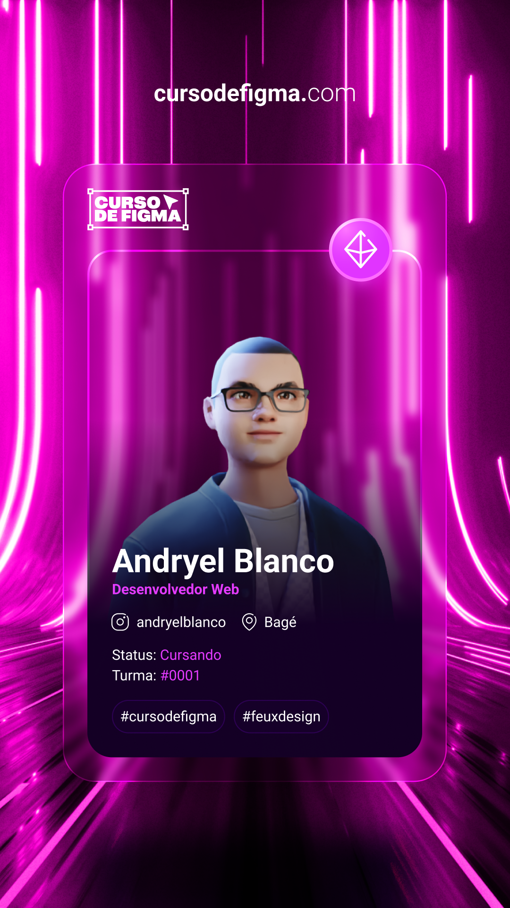

<h1> Heyy , I'm Andryel Blanco! </h1>

- 🔥 Jr React Developer

- 👨‍💻 All of my projects are available at [andryelblanco.online](https://andryelblanco.online)

- 💬 Ask me about **Javascript, ReactJS, Figma, Html, Css, Styled-Components**

  <h2>:mag: You find me here</h2>
  
  
   

 
 
<h2> 🛠 &nbsp;Tech Stack </h2>

 
  
  
  
  
  

 
 
 
<h2> ⚙️ &nbsp;GitHub Analytics</h2>

  <a href="https://github.com/AndryelBlanco">
  
  

